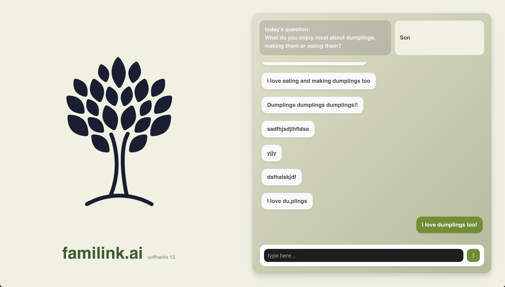

# 🌟 **Familink.ai** – Strengthening Family Bonds with AI  

  

Familink.ai is a web application designed to bring families closer through **personalized one-on-one interactions**. With daily AI-generated prompts, the app fosters meaningful conversations that evolve over time—helping family members stay connected in a way that feels natural and personal.  

💬 **Currently, Familink.ai supports private 1-on-1 chats**, but we’re building toward a future where families can engage in richer, more dynamic interactions—including shared group discussions, intergenerational storytelling, and more!  

---

## 🚀 **Features**  

### ✅ **One-on-One Chats**  
- 🔹 Private chat channels for deeper, more meaningful conversations between family members.  
- 🔹 AI-powered conversation starters to help kick off engaging discussions.  

### 🤖 **Daily Personalized Prompts**  
- 🔹 Smart, evolving prompts tailored to each relationship.  
- 🔹 AI learns from past interactions to make conversations more relevant over time.  

### 🔒 **Secure & Scalable**  
- 🔹 **Firebase** ensures **real-time updates** and **secure** data storage.  
- 🔹 Designed to be **fast, lightweight, and intuitive**.  

---

## 🛠 **Tech Stack**  

Familink.ai is built with a modern and scalable tech stack:  

- 🎨 **Frontend**: [React.js](https://reactjs.org/) – Dynamic and user-friendly interface  
- 🌍 **Backend**: [Node.js](https://nodejs.org/) – Handles API requests & server-side logic  
- 🔥 **Database**: [Firebase](https://firebase.google.com/) – Real-time updates & authentication  
- 🧠 **AI Integration**: [OpenAI API](https://platform.openai.com/) – Personalized, adaptive conversation prompts  

---

## 🌱 **Future Plans**  

While Familink.ai currently supports **private 1-on-1 conversations**, we’re working on exciting new features:  

🚧 **Upcoming Features**:  
- 👨‍👩‍👧 **Group Chats** – Foster interfamily discussions & shared storytelling.  
- 🎭 **Interactive AI Conversations** – More engaging and dynamic question flows.  
- 📅 **Memory Timeline** – Capture and revisit past conversations.  

We’d love to hear your thoughts and ideas as we grow! 💡  

---

## 💙 **Thanks for Checking Out Familink.ai!**  
